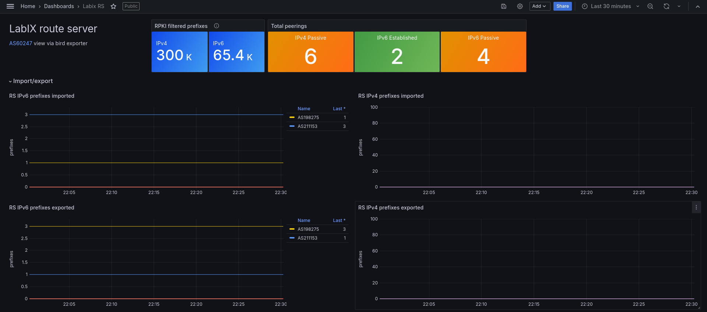
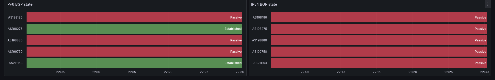

# Labitat Internet Exchange (LabIX) automation tool chain

Website: [ix.labitat.dk](https://ix.labitat.dk/)

We use Ansible to deploy changes, such as adding a new peer to the route server. Please check out [`ansible`](ansible/) directory for further details

# Join LabIX

Presuming that you already have an ASN and prefixes, do the following:

1. Read [peering policy](https://ix.labitat.dk/#peering-policy)
2. Join [LabiColo](https://labitat.dk/wiki/Labicolo), setup machine and [prepare routing daemon](https://ix.labitat.dk/documentation/)
3. Add your Autonomous System to the [`ix_client.yml`](./ix_client.yml) file, and create a pull request with changes.
4. Poke Hafnium to deploy Ansible playbook

# Architecture
## Client schema

The diagram below provides an overview of data dependencies in the automation tool-chain. Peering members must modify details in the blue boxes themselves, while administrator maintain fuchsia boxes to enrich data outputs. The boxes with white a background are automated outputs. Hugo website is handled [in a separate repository](https://github.com/labitat/ix.labitat.dk).

We've not yet fully implemented the following features:
- Automatic population to website
- Exposing IX-F schema
- Automatic upload of RPSL schema

## Route server

The route server architecture diagram below illustrates the various data sources used for generating the RS BIRD configuration.  have configured [ARouteServer](https://arouteserver.readthedocs.io/) to include bogon filters, check peering DB, use RPKI and use the peer config. ARouteServer then creates a Route Server config for BIRD to utilize.

# Metrics

The Grafana dashboard provides a view of the LabIX route server, showing established BGP peers and exported/imported routes. Data source is the [Prometheus BIRD exporter](https://github.com/czerwonk/bird_exporter). Dashboard will be [published soon-ish](./grafana_routes_server_dashboard.json).

